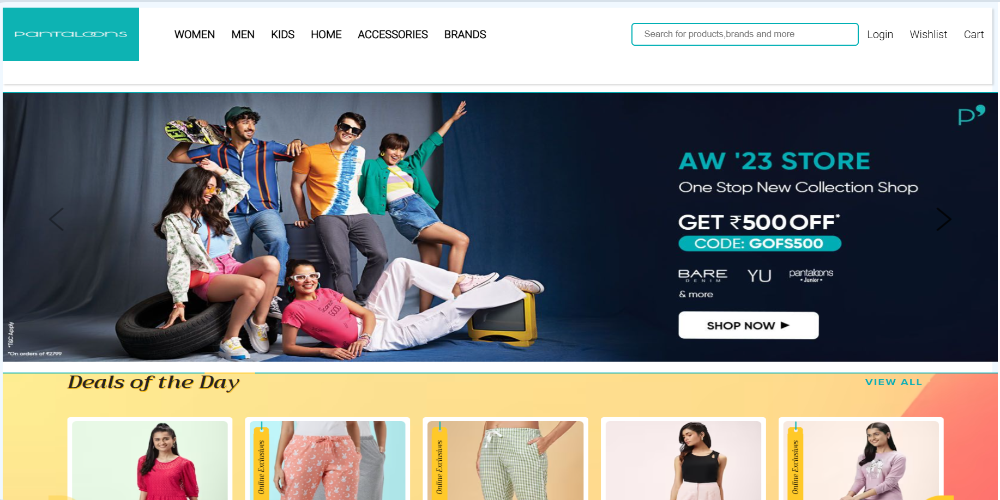
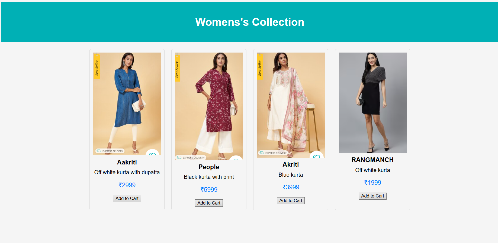
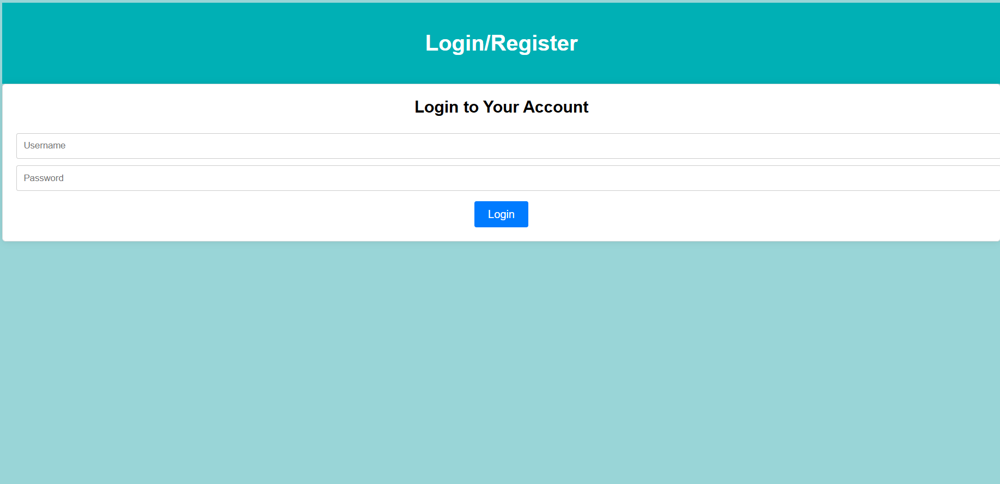

# E-commerce Platform  

A modern **frontend e-commerce website** designed to provide a seamless shopping experience. This project features a **women's clothing category**, an interactive homepage with promotional banners, and an easy-to-use **login page**.  

## Features  

- **Elegant UI** – Clean, modern, and visually appealing design.  
- **Product Listings** – Showcases women's clothing items with prices.  
- **Promotional Banners** – Displays special offers and featured collections.  
- **Login & Wishlist** – Secure login page with options to save favorite items.  
- **Fully Responsive** – Optimized for desktops, tablets, and mobile devices.  

## Technologies Used  

- **HTML5** – Structuring the web pages  
- **CSS3** – Styling for an elegant and user-friendly interface  

## Installation & Setup  

To run this project locally, follow these steps:  

1. **Clone the repository**  
   ```sh
   git clone https://github.com/yourusername/pantaloons.git
   ```
2. **Navigate to the project directory**  
   ```sh
   cd pantaloons
   ```
3. **Open in Browser**  
   Simply open the `index.html` file in your web browser to view the project.  

## Preview  

  
  
  
